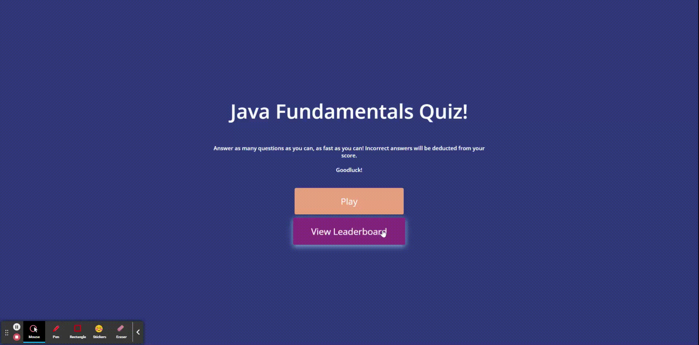
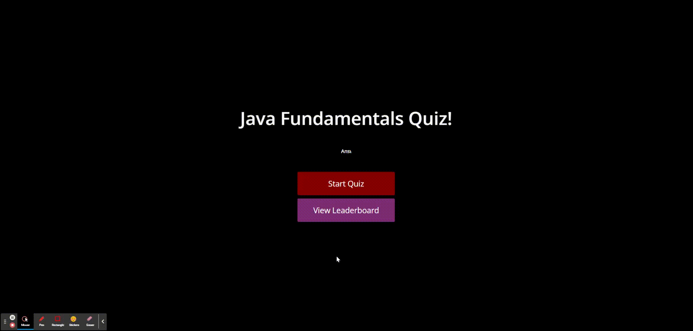

# Web-APIs-Challenge-Code-Quiz


This repository contains a timed quiz on JavaScript fundamentals, designed specifically for coding boot camp students. The quiz allows students to test their knowledge of JavaScript concepts, while also providing a competitive element by storing and displaying high scores.

## User Story

```
AS A coding boot camp student
I WANT to take a timed quiz on JavaScript fundamentals that stores high scores
SO THAT I can gauge my progress compared to my peers
```

## Acceptance Criteria

```
GIVEN I am taking a code quiz
WHEN I click the start button
THEN a timer starts and I am presented with a question
WHEN I answer a question
THEN I am presented with another question
WHEN I answer a question incorrectly
THEN time is subtracted from the clock
WHEN all questions are answered or the timer reaches 0
THEN the game is over
WHEN the game is over
THEN I can save my initials and my score
```
## Features

- Multiple-choice questions: The quiz presents a series of multiple-choice questions related to JavaScript fundamentals. Students can select the correct answer from the available options.

- Timed quiz: The quiz is timed, creating a sense of urgency and encouraging students to answer questions quickly. The remaining time is displayed during the quiz.

- Score tracking: The quiz tracks the scores of the students and stores the highest scores achieved. This feature allows students to compare their progress with their peers.

- High score leaderboard: A leaderboard displays the highest scores achieved by various students. This provides a sense of competition and motivation to improve.

- Feedback and explanations: After each question, the quiz provides immediate feedback, indicating whether the selected answer was correct or incorrect. In addition, it offers explanations for the correct answers, helping students to learn from their mistakes.

## Technologies Used

- HTML
- CSS
- JavaScript
  
## Demo
<!--   -->


## Deployment

The URL of the deployed application: https://charltonortega.github.io/Web-APIs-Challenge-Code-Quiz/

The URL of the GitHub repository: https://github.com/Charltonortega/Web-APIs-Challenge-Code-Quiz

## References

This project was greatly influenced and inspired by several resources. Below are detailed descriptions of these resources and the extent of their influence:

1. **[YouTube Tutorial](https://www.youtube.com/watch?v=f4fB9Xg2JEY&t=2996s)**: This step-by-step tutorial by Brian Design, titled "How to Make a Quiz App using HTML CSS Javascript - Vanilla Javascript Project for Beginners Tutorial" served as a primary guide for creating this proejct. Brian introduces key concepts and demonstrates how to develop a functional quiz system. Several methodologies and techniques demonstrated in this tutorial were adapted for this project. However, the code written is original and reflects my interpretation of the tutorial's concepts.

If you're interested in the specifics, here are the main topics the video covers that have been adapted for this project:

    - Creating a basic structure for quizzes
    - Designing interactive questions and answer options
    - Implementing a scoring system

Please note that while these resources significantly contributed to the development of the project, the codebase for this project is original and was re-written by myself. The knowledge and methods learned from these resources have been crucial to the project's realization.

Finally, a special thanks to Brian Design for their insightful and easy-to-follow tutorial.

